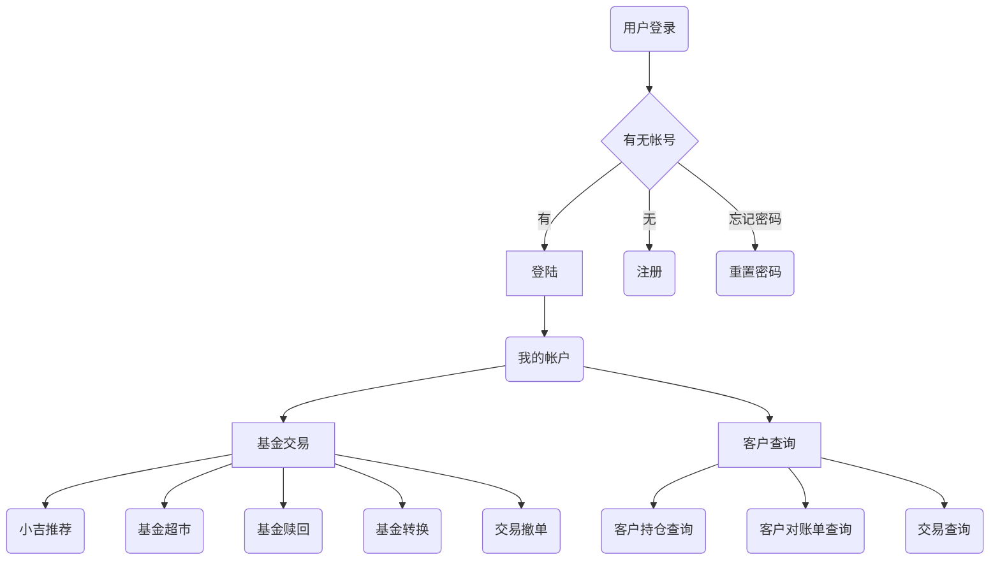

aboutGit
========

 這是Git相關的說明

 see http://gatorliu.github.io/aboutGit

Test

```mermaid
graph TD;
  A(用户登录) --> B{有无帐号}
	B --> |有|C[登陆]
	B --> |无|D(注册)
    B --> |忘记密码|E(重置密码)
    C --> F(我的帐户)
    F --> G[基金交易]
    F --> H[客户查询]
    G --> I(小吉推荐)
    G --> P(基金超市)
    G --> J(基金赎回)
    G --> K(基金转换)
    G --> L(交易撤单)
    H --> M(客户持仓查询)
    H --> N(客户对账单查询)
    H --> O(交易查询)
```
