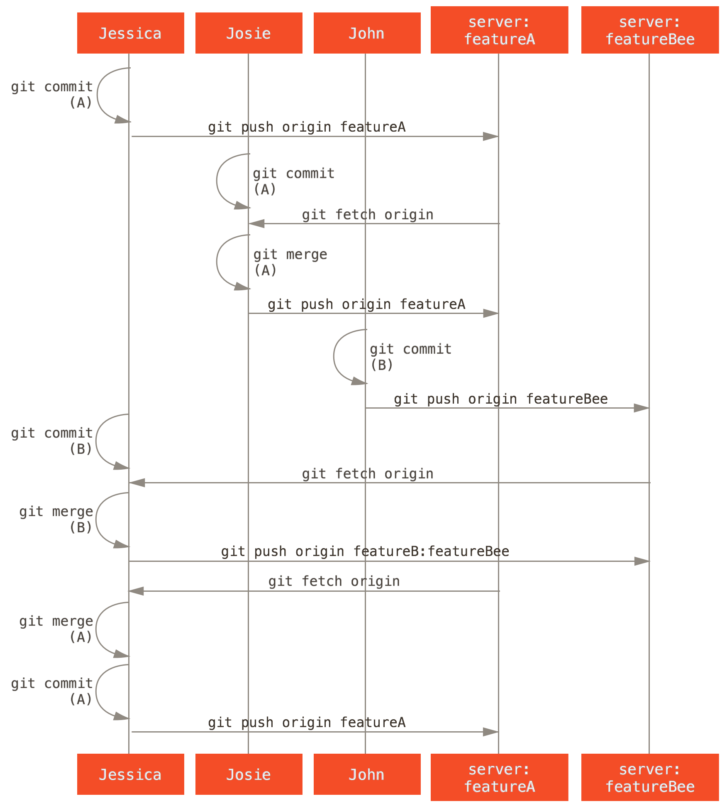

# Git 簡介

> 分散式版本控制 

* James Liu
* james_liu@glf.com.cn

## 版本控制大家都知道了

所以就直接說說 '分散式 Distributed' 

###  先看看集中式 （Centralized）

有一台中央團隊共用的Repository，每個團隊成員從Repository獲取檔案，編修後再放回。

* 如果有別人也修改同一個檔案(稱作衝突)，進行手動編修解決。
* VSC, SVN
* Centralized VCS 的共同缺點是做什麼事都要跟伺服器連線，會比較慢。
* 另外也有單點故障的風險(Single point of failure)。

### 
 

### Distributed

分散式版本控制系統讓本地端也擁有完整的Repository，就沒有上述集中式的問題，即使沒網路，照常可以 commit 和看 history log，也不用擔心server備份。

* Git, Mercurial(Hg), Bazaara

### 
  

### 有缺點嗎？

* 若要說有什麼缺點，就是能力越大，功能就越複雜，一開始學習上會比較辛苦一點。
* 每個人都有完整Repository，是優點還是缺點 ？？

### 就功能來說

In fact, The centralized VCS is a subset of what a distributed model can do. 

## 開始說Git吧！

> 從實際例子出發  
> 不(少)講操作與指令，重點放在管理面(概念) 
> 試圖解決目前版本控管的問題 

* What is Git & Why Git?
* 分支! 
* 私有的小型團隊
* 私有團隊間協作
* 公開的小（大）型專案 -- 略

## What is Git?

* 	Git 最早是 Linus Torvalds 用以取代非開源的 BitKeeper 分散式版本控制系統，經快速的開發後，現已被全球眾多知名自由軟體專案採用，儼然是新生代的基礎建設之一。
-- [Jserv](http://blog.linux.org.tw/~jserv/archives/002019.html)

## Why Git?
* 'Why Git is Better than X' Said: 
	* 便宜的本地分支
	* Git 很快,很小巧.....
* github 
	* open source developer
	* GitCafe  
* ............我只會git 

## '本地'的'分支'
如果你想寫一個新功能，但是他可能要花你一週的時間。當寫了一半時，有一個Bug需要立刻處理.......

	git checkout -b ........

	git merge ...
	git rebase ...

### 

一個 Branch & Merge 示意圖

注意：	本地！本地！

 
### 遠端怎麼做?

* git pull.............
	* fetch + merge
* git push 

## 私有的小型團隊

	From progit 5.2

<pre>
從最簡單的情況開始，一個私有專案，一起協作的有兩位開發者(John and Jessic)。這裡說私有，是指原始程式碼不公開，其他人無法訪問項目倉庫。而開發者則都具有推送資料到倉庫的許可權。

這種情況下，可以用 Subversion 或其他集中式版本控制系統類似的工作流來協作。但仍然可以得到 Git 帶來的其他好處：離線提交，快速分支與合併等等，但工作流程還是差不多的。
</pre>

主要區別在於，合併操作發生在用戶端而非伺服器上。 

### Flow

### Status 
	合併 John 的更新後 Jessica 的提交歷史
 		

	PS :Jessica 的本地倉庫歷史多出了 John 的兩次提交（738ee 和 72bbc）

## 私有團隊間協作
	From progit 5.2
<pre>
假設 John 和 Jessica 一起負責開發某項特性 A，而同時 Jessica 和 Josie 一起負責開發另一項功能 B。公司使用典型的集成管理員式工作流，每個組都有一名管理員負責集成本組代碼，及更新專案主倉庫的 master 分支。所有開發都在代表小組的分支上進行。
</pre>
！！似乎是，最適合我們的工作方式！！

### Flow

### Status 
	Jessic 在管理員完成集成工作後，主分支上便多出一個新的合併提交（5399e），
	用 fetch 命令更新到本地後，提交歷史
 		

## Othes
* 反悔
* 全縣控制
* diff

## 參考：

* http://git-scm.com/book/zh
* http://ihower.tw/git/
* http://betterexplained.com/articles/intro-to-distributed-version-control-illustrated/
* http://www.rittmanmead.com/2013/07/mds-xml4/