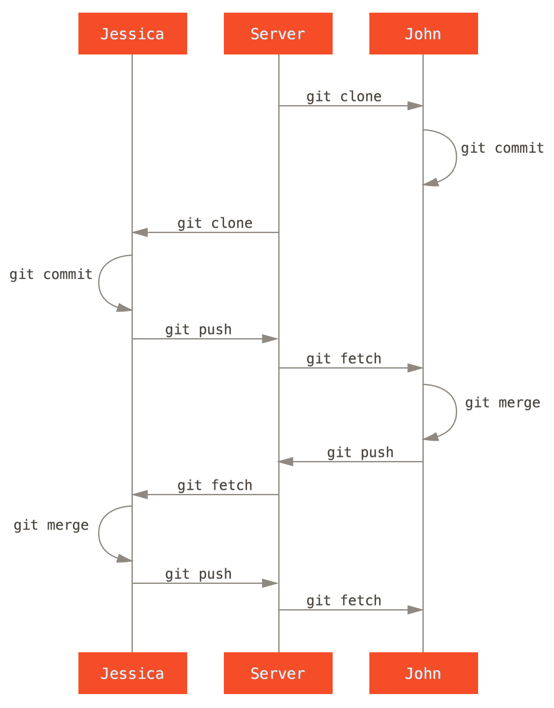
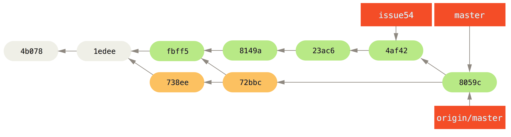

# Git 简介

> 分散式版本控制 

* James Liu
* james_liu@glf.com.cn


## 版本控制大家都知道了

所以就直接说说 '分散式 Distributed' 


###  先看看集中式 （Centralized）

有一台中央团队共享的Repository，每个团队成员从Repository获取档案，编修后再放回。


* 如果有别人也修改同一个档案(称作冲突)，进行手动编修解决。
* VSC, SVN
* Centralized VCS 的共同缺点是做什么事都要跟服务器连线，会比较慢。
* 另外也有单点故障的风险(Single point of failure)。


### 
 


### Distributed

分散式版本控制系统让本地端也拥有完整的Repository，就没有上述集中式的问题，即使没网络，照常可以 commit 和看 history log，也不用担心server备份。

* Git, Mercurial(Hg), Bazaara


### 
  


### 有缺点吗？

* 若要说有什么缺点，就是能力越大，功能就越复杂，一开始学习上会比较辛苦一点。
* 每个人都有完整Repository，是优点还是缺点 ？？


### 就功能来说

In fact, The centralized VCS is a subset of what a distributed model can do. 


## 开始说Git吧！

> 从实际例子出发  
> 不(少)讲操作与指令，重点放在管理面(概念) 
> 试图解决目前版本控管的问题
> Demo (?) 

* What is Git & Why Git?
* 本地的分支
* 集中式工作流
* 集成管理员工作流
* 司令官与副官工作流
* Others
* 参考


## What is Git?

* 	Git 最早是 Linus Torvalds 用以取代非开源的 BitKeeper 分散式版本控制系统，经快速的开发后，现已被全球众多知名自由软件项目采用，俨然是新生代的基础建设之一。
-- [Jserv](http://blog.linux.org.tw/~jserv/archives/002019.html)

* http://git-scm.com/ --local-branching-on-the-cheap


### 设计时的目标
* 快速
* 简洁的设计
* 完整支援非线性的开发（上千个同时进行的分支）
* 完全的分散式系统
* 能够有效地处理像 Linux kernel 规模的项目（速度及资料大小）
	* 15,000,000+ Lines
	* 1300+ Developers 
	
	[资料来源 2012](http://royal.pingdom.com/2012/04/16/linux-kernel-development-numbers/)


## Why Git?
* 'Why Git is Better than X' Said: 
	* 便宜的本地分支
	* Git 很快,很小巧.....
* github 
	* open source developer
	* GitCafe  
* ............我只会git 


## ```本地```的```分支```!
如果你想写一个新功能，但是他可能要花你一周的时间。当写了一半时，有一个Bug需要立刻处理.......

	git checkout -b ........

	git merge ...
	git rebase ...


### 

一个 Branch & Merge 示意图

```本地！本地！```


 
### 远端怎么做?


* git pull.............
	* fetch + merge
* git push 


## 集中式工作流
适用于```私有的小型团队```


### Case study
	From progit 5.2
<pre>
从最简单的情况开始，一个私有项目，一起协作的有两位开发者(John and Jessic)。这里说私有，是指原始程序码不公开，其他人无法访问项目仓库。而开发者则都具有推送资料到仓库的权限。

这种情况下，可以用 Subversion 或其他集中式版本控制系统类似的工作流来协作。但仍然可以得到 Git 带来的其他好处：离线提交，快速分支与合并等等，但工作流程还是差不多的。
</pre>

```主要区别在于，合并操作发生在用户端而非服务器上。```


#### Flow



#### Status 
	合并 John 的更新后 Jessica 的提交历史
 		


	PS :Jessica 的本地仓库历史多出了 John 的两次提交（738ee 和 72bbc）


## 集成管理员工作流
适用于```私有团队间协作```与 ```公开的小型项目```


```差异在于 Repository 的权限与```


### Case Study 
	From progit 5.2
<pre>
假设 John 和 Jessica 一起负责开发某项特性 A，而同时 Jessica 和 Josie 一起负责开发另一项功能 B。公司使用典型的集成管理员式工作流，每个组都有一名管理员负责集成本组代码，及更新项目主仓库的 master 分支。所有开发都在代表小组的分支上进行。
</pre>
```！！似乎是，最适合我们的工作方式！！```


#### Flow


#### Status
<pre> 
	Jessic 在管理员完成集成工作后，主分支上便多出一个新的合并提交（5399e），
	用 fetch 命令更新到本地后，提交历史
</pre>	


### 關於合併與衝突
   有些時候`人工`的介入還是不可避免的。但是git提供了些工具：

* merge
* diff + apply 


### Merge
   ref: progit 3.2
   ```
   git checkout featureBee
   git merge featureA
   # ............ run and debug here.............
   git commit -am ""
   ```
   more complicated
   ```
   git checkout -b featureBee_addA
   git merge featureA
   # ............ run and debug .............
   git stash
   git checkout featureBee
   git stash pop
   git commit -am ""
   ```


### Merge Conflicts

   ```
   $ git merge iss53
   Auto-merging index.html
   CONFLICT (content): Merge conflict in index.html
   Automatic merge failed; fix conflicts and then commit the result.
   ```

   ```
   <<<<<<< HEAD
   <div id="footer">contact : email.support@github.com</div>
   =======
   <div id="footer">
     please contact us at support@github.com
     </div>
     >>>>>>> iss53
   ```


### diff + apply
* git diff ->  git apply 
* git format-patch -> git am (apply mail)
* Unix Like 系統上常用的工具 diff and patch  。
 (git bash 一個提供Linux 工具的 Windows console (grep, sed, awk .........))
   
   Jessica
   ```
   git diff master > featureA.patch
   ```
   Josie
   ```
   git checkout featureBee
   git apply patch
   ```


## 司令官与副官工作流
适用于```公开的大型项目```


## Others
<pre>
	再说一些关于git的事情 .... 
</pre>


### 储藏 (Stashing)
<pre>
经常有这样的事情发生，当你正在进行项目中某一部分的工作，里面的东西处于一个比较杂乱的状态，而你想转到其他分支上进行一些工作。问题是，你不想只为了待会要回到这个工作点，就把做到一半的工作进行提交。解决这个问题的办法就是 git stash 命令。

「储藏」可以获取你工作目录的 dirty state——也就是你修改过的被追踪档和暂存的变更——并将它保存到一个未完成变更的堆栈(stack)中，随时可以重新应用
</pre>


### 一点点技术细节
<pre>
	Git与所有其它版本控制系统最重要的区别。 它完全颠覆传统版本控制的作法。 这使用Git更像一个上层具备更强大工具的小型档案系统，而不只是版本控制系统。
</pre>


#### others VC: Deltas


#### git : Snapshots


### Git and X

* X == SVN
	<pre>progit 8.2 Git 与其他系统 - 迁移到 Git</pre>
* X == Windows
	<pre>没问题，还附赠 git console (with bash)</pre>
	* download: http://git-scm.com/download/win
* X == Eclipse
	<pre>EGit(http://eclipse.org/egit)</pre>
	* Eclipse using Git: http://git.eclipse.org/c/


### 如果公司决定不用 Git了 

	你还是可以 学/使用 Git，因为：

* Github.com
	* https://github.com/jquery/jquery
	* https://github.com/mybatis/mybatis-3
	* Ruby (ROR)................
	
* 管理自己的档案，也可以用git
	* 记得吗？ Git更像一个小型档案系统 （.git）
        ``` 
         cp foo.txt foo.txt.20141130  # 已成往事
        ```
        * 我用 git + markdown / wiki 
        * 有人 git 整个 /etc/ 或 logs


## 参考


### A successful Git branching model
* [原文 http://nvie.com/posts/a-successful-git-branching-model/](http://nvie.com/posts/a-successful-git-branching-model/)
* [翻译 http://www.juvenxu.com/2010/11/28/a-successful-git-branching-model/](http://www.juvenxu.com/2010/11/28/a-successful-git-branching-model/)
* [tool - git-flow](https://github.com/nvie/gitflow)


### URLs
* http://git-scm.com/book/zh
* http://ihower.tw/git/
* http://betterexplained.com/articles/intro-to-distributed-version-control-illustrated/
* http://www.rittmanmead.com/2013/07/mds-xml4/


### Try git on Github

	git clone X
	
here X =
	 
* This Slide
   * https://github.com/gatorliu/aboutGit.git
* ProGit2
   * https://github.com/progit/progit2.git
* Why git is better then X
   * https://github.com/schacon/whygitisbetter.git 


### Demo or not !?


# Question & Answer

## Thank you very much ! 
