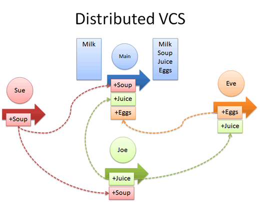
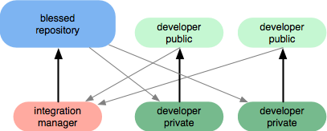

# Git 簡介

> 分散式版本控制 

* James Liu
* james_liu@glf.com.cn


## 版本控制大家都知道了

所以就直接說說 '分散式 Distributed' 


###  先看看集中式 （Centralized）

有一台中央團隊共用的Repository，每個團隊成員從Repository獲取檔案，編修後再放回。


* 如果有別人也修改同一個檔案(稱作衝突)，進行手動編修解決。
* VSC, SVN
* Centralized VCS 的共同缺點是做什麼事都要跟伺服器連線，會比較慢。
* 另外也有單點故障的風險(Single point of failure)。


### 
 


### Distributed

分散式版本控制系統讓本地端也擁有完整的Repository，就沒有上述集中式的問題，即使沒網路，照常可以 commit 和看 history log，也不用擔心server備份。

* Git, Mercurial(Hg), Bazaara


### 
  


### 有缺點嗎？

* 若要說有什麼缺點，就是能力越大，功能就越複雜，一開始學習上會比較辛苦一點。
* 每個人都有完整Repository，是優點還是缺點 ？？


### 就功能來說

In fact, The centralized VCS is a subset of what a distributed model can do. 


## 開始說Git吧！

> 從實際例子出發  
> 不(少)講操作與指令，重點放在管理面(概念) 
> 試圖解決目前版本控管的問題
> Demo (?) 

* What is Git & Why Git?
* 本地的分支
* 集中式工作流
* 集成管理員工作流
* 司令官與副官工作流
* Others
* 參考


## What is Git?

* 	Git 最早是 Linus Torvalds 用以取代非開源的 BitKeeper 分散式版本控制系統，經快速的開發後，現已被全球眾多知名自由軟體專案採用，儼然是新生代的基礎建設之一。
-- [Jserv](http://blog.linux.org.tw/~jserv/archives/002019.html)

* http://git-scm.com/ --local-branching-on-the-cheap


### 設計時的目標
* 快速
* 簡潔的設計
* 完整支援非線性的開發（上千個同時進行的分支）
* 完全的分散式系統
* 能夠有效地處理像 Linux kernel 規模的專案（速度及資料大小）
	* 15,000,000+ Lines
	* 1300+ Developers 
	
	[資料來源 2012](http://royal.pingdom.com/2012/04/16/linux-kernel-development-numbers/)


## Why Git?
* 'Why Git is Better than X' Said: 
	* 便宜的本地分支
	* Git 很快,很小巧.....
* github 
	* open source developer
	* GitCafe  
* ............我只會git 


## ```本地```的```分支```!
如果你想寫一個新功能，但是他可能要花你一週的時間。當寫了一半時，有一個Bug需要立刻處理.......

	git checkout -b ........

	git merge ...
	git rebase ...


### 

一個 Branch & Merge 示意圖

```本地！本地！```


 
### 遠端怎麼做?


* git pull.............
	* fetch + merge
* git push 


## 集中式工作流
適用於```私有的小型團隊```


### Case study
	From progit 5.2
<pre>
從最簡單的情況開始，一個私有專案，一起協作的有兩位開發者(John and Jessic)。這裡說私有，是指原始程式碼不公開，其他人無法訪問項目倉庫。而開發者則都具有推送資料到倉庫的許可權。

這種情況下，可以用 Subversion 或其他集中式版本控制系統類似的工作流來協作。但仍然可以得到 Git 帶來的其他好處：離線提交，快速分支與合併等等，但工作流程還是差不多的。
</pre>

```主要區別在於，合併操作發生在用戶端而非伺服器上。```


#### Flow


#### Status 
	合併 John 的更新後 Jessica 的提交歷史
 		


	PS :Jessica 的本地倉庫歷史多出了 John 的兩次提交（738ee 和 72bbc）


## 集成管理員工作流
適用於```私有團隊間協作```與 ```公開的小型專案```


```差異在於 Repository 的權限與```


### Case Study 
	From progit 5.2
<pre>
假設 John 和 Jessica 一起負責開發某項特性 A，而同時 Jessica 和 Josie 一起負責開發另一項功能 B。公司使用典型的集成管理員式工作流，每個組都有一名管理員負責集成本組代碼，及更新專案主倉庫的 master 分支。所有開發都在代表小組的分支上進行。
</pre>
```！！似乎是，最適合我們的工作方式！！```


#### Flow


#### Status
<pre> 
	Jessic 在管理員完成集成工作後，主分支上便多出一個新的合併提交（5399e），
	用 fetch 命令更新到本地後，提交歷史
</pre>	


## 司令官與副官工作流
適用於```公開的大型專案```


## Others
<pre>
	再說一些關於git的事情 .... 
</pre>


### 儲藏 (Stashing)
<pre>
經常有這樣的事情發生，當你正在進行專案中某一部分的工作，裡面的東西處於一個比較雜亂的狀態，而你想轉到其他分支上進行一些工作。問題是，你不想只為了待會要回到這個工作點，就把做到一半的工作進行提交。解決這個問題的辦法就是 git stash 命令。

「儲藏」可以獲取你工作目錄的 dirty state——也就是你修改過的被追蹤檔和暫存的變更——並將它保存到一個未完成變更的堆疊(stack)中，隨時可以重新應用
</pre>


### 一點點技術細節
<pre>
	Git與所有其它版本控制系統最重要的區別。 它完全顛覆傳統版本控制的作法。 這使用Git更像一個上層具備更強大工具的小型檔案系統，而不只是版本控制系統。
</pre>


#### others VC: Deltas


#### git : Snapshots


### Git and X

* X == SVN
	<pre>progit 8.2 Git 與其他系統 - 遷移到 Git</pre>
* X == Windows
	<pre>沒問題，還附贈 git console (with bash)</pre>
	* download: http://git-scm.com/download/win
* X == Eclipse
	<pre>EGit(http://eclipse.org/egit)</pre>
	* Eclipse using Git: http://git.eclipse.org/c/


### 如果公司決定不用 Git了 

	你還是可以 學/使用 Git，因為：

* Github.com
	* https://github.com/jquery/jquery
	* https://github.com/mybatis/mybatis-3
	* Ruby (ROR)................
	
* 管理自己的檔案，也可以用git
	* 記得嗎？ Git更像一個小型檔案系統 （.git）
	* git + markdown
	* git + wiki 


## 參考


### A successful Git branching model
* [原文 http://nvie.com/posts/a-successful-git-branching-model/](http://nvie.com/posts/a-successful-git-branching-model/)
* [翻譯 http://www.juvenxu.com/2010/11/28/a-successful-git-branching-model/](http://www.juvenxu.com/2010/11/28/a-successful-git-branching-model/)
* [tool - git-flow](https://github.com/nvie/gitflow)


### URLs
* http://git-scm.com/book/zh
* http://ihower.tw/git/
* http://betterexplained.com/articles/intro-to-distributed-version-control-illustrated/
* http://www.rittmanmead.com/2013/07/mds-xml4/


### Try git on Github

	git clone X
	
here X =
	 
* https://github.com/gatorliu/aboutGit.git - This Slide
* https://github.com/progit/progit2.git    - ProGit
* https://github.com/schacon/whygitisbetter.git - Why git is better then X


# Question & Answer

## Thank you very much ! 